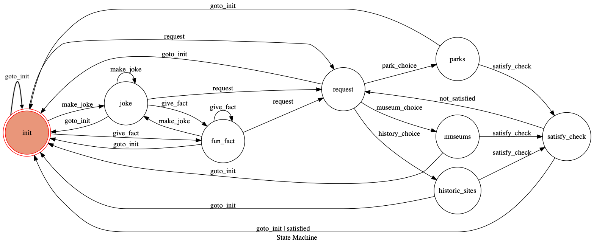

# Botty
Botty is a Facebook Messenger chatbot which can tell jokes, fun facts, or find a place for you to go in Tainan. 

## Implementation
Botty is implemented using Python3. In order to progress though the conversation with Botty, a state machine is used. Depending on the state, and the user input, Botty will react differently. Botty queries data from a MongoDB database, and is deployed on Heroku.

## Interacting with Botty
Botty can understand a limited amount of language from the user. She searches the user input for key words which will help her identify the users request. 

When starting the conversation with Botty, you can either greet her, ask for a joke or a fun fact, ask her what she can do, or directly ask her to find a place for you to go to. 
1. **Greet:** You can say something like "hi", "hey", "hi Botty" and she will reply.
2. **Joke:** You can say something along the lines of "Tell me a joke", or "Make me laugh", and she will try her best.
3. **Fun fact:** Similar to the joke, "Tell me a fun fact", or "I want to hear something interesting" will prompt Botty to
4. **Ask her what she can do:** "What can you do?", "Tell me what you can do" or any variant with "can do" will prompt Botty to tell you about her abilities. 
5. **Find a place:** "Can you find somewhere for me to go?", "I want to go somewhere", "I'm looking for a place to go to" or similar variants.
6. **Restart:** Remember, you can always restart the conversation with Botty by saying "Restart" or "start over" or "let's try again".

After you request botty to find a place for you to go to, she will present you with 3 choices (parks, museums, or historic sites). You may choose one of them, which will prompt Botty to further give you additional 3 choices in the category of your choice (meaning if you chose parks, she will present 3 parks in Tainan for you to choose). Finally, after you choose a specific place, Botty will provide you the address, and a Google Maps link to that place!

## Example of a complete conversation with Botty
1. User: "Hi Botty!"
2. Botty: "Hi there! What can I do for you?"
3. User: "Can you find a place for me to go?"
4. Botty: "Okay! Would you prefer to go to a park, a museum, or a historic site?"
5. User: "A museum!"
6. Botty: "I have a couple of choices for you...which one would you prefer? Chimei Museum, National Museum of Taiwan History, or Taiwan Salt Museum Which one would you like to go to?" *after this botty will send 3 images, 1 of each choice*
7. User: "Chimei Museum"
8. Botty: "Sounds good! Here is the address: No. 66號, Section 2, Wenhua Road, Rende District, Tainan City, 71755 And the link to the map: https://goo.gl/maps/Dah9VeZ2uNr Have fun!"

## Botty Finite State Machine

